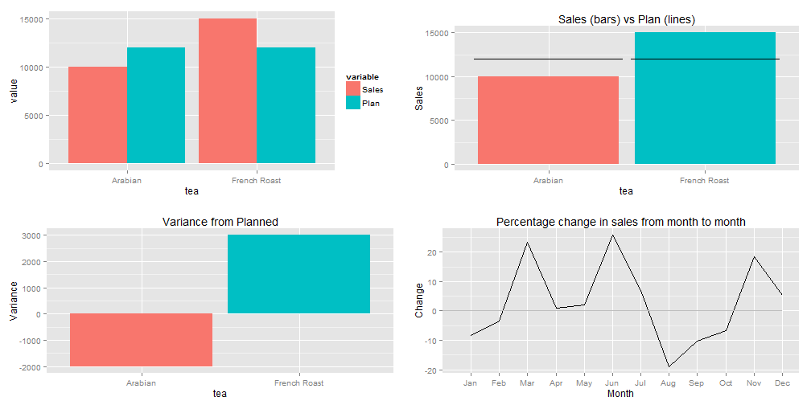
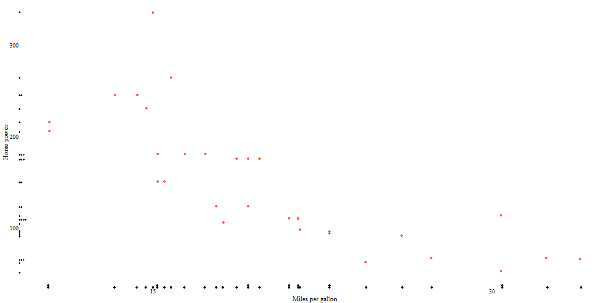
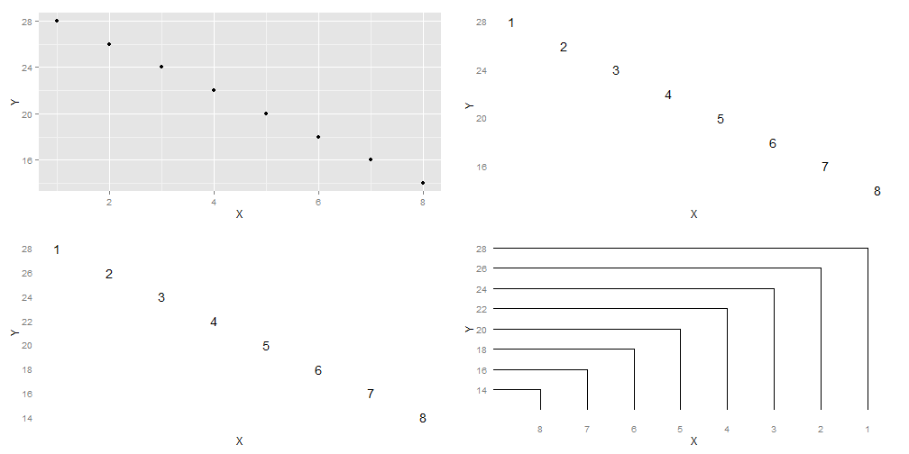

## Representation of quantitative values

* points
* lines
* bars
* boxes
* shapes with varying 2-D areas
* shapes with varying color intensity

---
## Encoding Categorical Variables
 
 * 2D position
 * Hue
 * Point Shape
 * Fill pattern
 * Line Style

---
## Relationships usually displayed in graphs

* Time Series: Changes in variable(s) over time (Change, rise, increase, fluctuate, grow, decline, decrease, trend)
* Ranking (larger/smaller/equal to/greater/lesser)
* Part-to-whole (rate/percent/share of total/accounts for n percent)
* Deviation (absolute/percentage/rate of deviations from a reference value,)
* Distribution (frequency, distribution, range, concentration, normal)
* Correlation (how variables covary - increases/decreases/changes with, caused by, affected by)
* Geospatial (spatial, geographical - county/city/region/state/...)
* Nominal comparison (simple comparison of categorical variables - alphabetical/ascending/descending)

---

## Nominal Comparisons
 

---
## Time Series
 

---
## Ranking

 

---
## Part-to-Whole

 

---
## Part-to-Whole
Pie-charts, for their disadvantages, are easily recognized. Can use bars close to each other.
 

---
## Deviation Designs
 

---
## Studying Distributions

 

---
## More distributions

 

---
## Correlations

 

---
## Geo-Spatial Designs

 

---
## Geo-Spatial Designs

 

---
## Geo-Spatial Designs

 

---
## Geo-Spatial Designs

---

## Graphs versus Tables 

* Graphs for richer, more complex and more difficult statistical material. Show comparisons/relationships.
* If data can be summarized in one or two numbers, use numbers.
* Small, noncomparative, highly labeled datasets in tables.
* If datasets have 20 numbers or fewer, use tables

---

## Aesthetics and Technique

Graphical elegance is often found in simplicity of design and complexity of data

* Avoid sentence when having more than two numbers
* Tables are best to show exact numerical values.
* Pie-charts are dumb, series of them are dumber - never use them
* A supertable that permits many comparisons may be better than a series of little bar charts - Always?
* Mix words with graphics and tables. They have a single purpose - presentation of information.
* Avoid "See figure x". 
* Purpose of graphic - in exploratory data analysis, words should tell viewer how to read the design and not what to read in terms of content. (Other purposes could be description, tabulation, or decoration)
* Proportion and scale  
  * line weight and lettering
  * shape (tend towards horizontal) (1:1.4-1:1.8)

---

## Maximize Data-Ink Ratio 

* data-ink: Non-erasable core of a graphic
* non-data ink: erasable components of a graphic (e.g., axis lines, tick marks, labels...)
* data-ink ratio = (data-ink/total-ink)=(1-proportion of graphic that can be erased without loss of data-information)

For non-data-ink, less is more; For data-ink, less is a bore (Tufte credits Ludwig Mies van der Rohe and Robert Venturi)

---
## Improving data-ink by emphasizing data?

 

---
## Background? White versus grey or any other color?

 

---
## Gridlines?

 

---
## Framing

 

---
## Box plot
 

---
## Scatter plots

 

---
## Dot-dash plot + box-plots + means = Dot-dash-mean-box plots
Mean in blue and median in red

 

---
## Dot-Dot Mean Box-plots
 

---
<<<<<<< HEAD
## Dot-Dotplots
 

---
## Bar plots (dummy data)

 

---

## Multifunctioning Graphical Elements

* Mobilize every graphical element to show the data - can lead to complexity
 

---
## Slopegraph

 

---
## High Data Density plots
data density = number of entries in data array/area of data graphic
  
300 numbers per square inch

---

## Small Multiples

Collections of mini figures arranged to portray a single animated figure (e.g.,Gelman's voucher map)

---
## Sparklines - Word-sized graphics - Example, change in population of Austria (1981-2009)

<!-- html table generated in R 3.1.1 by xtable 1.7-3 package -->
<!-- Mon Sep 15 11:48:47 2014 -->
<TABLE border=1>
<TR> <TH>  </TH> <TH> Mean </TH> <TH> Boxplot </TH> <TH> LinePlot </TH> <TH> BarPlot </TH> <TH> Current value </TH>  </TR>
  <TR> <TD align="right"> Total </TD> <TD> 7884750.66 </TD> <TD>  </TD> <TD>  </TD> <TD>  </TD> <TD> 8355260 </TD> </TR>
  <TR> <TD align="right"> Men </TD> <TD> 3791573.55 </TD> <TD>  </TD> <TD>  </TD> <TD>  </TD> <TD> 4068047 </TD> </TR>
  <TR> <TD align="right"> Women </TD> <TD> 4093177.1 </TD> <TD>  </TD> <TD>  </TD> <TD>  </TD> <TD> 4287213 </TD> </TR>
  <TR> <TD align="right"> Men per 1000 Women </TD> <TD> 925.97 </TD> <TD>  </TD> <TD>  </TD> <TD>  </TD> <TD> 949 </TD> </TR>
  <TR> <TD align="right"> Age 0-19 </TD> <TD> 1899456.83 </TD> <TD>  </TD> <TD>  </TD> <TD>  </TD> <TD> 1763948 </TD> </TR>
  <TR> <TD align="right"> Age 20-64 </TD> <TD> 4778240 </TD> <TD>  </TD> <TD>  </TD> <TD>  </TD> <TD> 5140425 </TD> </TR>
  <TR> <TD align="right"> Age 65+ </TD> <TD> 1207053.83 </TD> <TD>  </TD> <TD>  </TD> <TD>  </TD> <TD> 1450887 </TD> </TR>
  <TR> <TD align="right"> Age 75+ </TD> <TD> 541649.59 </TD> <TD>  </TD> <TD>  </TD> <TD>  </TD> <TD> 665415 </TD> </TR>
   </TABLE>
<!-- .html was created.-->

---

## Deception in Graphs

* Truth telling - bars with a zero base
* Comparison of equal time frames (4 quarters in a year versus 2 quarters in another year)
* Distortion of graphic: Visual representation of data not consistent with numerical representation of data 
  * lie factor = size of effect shown in graphic /size of effect in data; .95-1.5 good, 1, best.
* Show variations in data and do not introduce variations in design of chart (3D needed?)
* In time series displays of money, use deflated and standardized units of monetary measurements over nominal units.
* Distortion by using areas to show one-dimensional data - (a) ambiguities in perception of 2D surfaces to convert to a one-D number; (b) changes in physical areas do not produce proportional changes in perceived areas. The number of information-carrying dimensions (variables) in graphics should not exceed number of dimensions in data.

---
## Deception: Zero Base in Bar Charts

 

---
## Lie factor of 14.8

---

## Lie factor of 9.4

---

## Lie factor of 2.8 (plus other issues)

---

## Using multiple dimensions to depict one dimensional change

   
Surface area of 1978 dollar should've been twice as big as shown to reflect purchasing power change

---

## Time frame deception

---

## Chartjunk

* Vibration and movement in optics: Design interactions with physiological tremor of eye
  + Use shades of gray when color fills not advisable
  + label with words than create cross-hatched designs

* Gridlines: None versus shades of grey?

---
## Avoid

---

=======

>>>>>>> origin/gh-pages
## Acknowledgement for images, content used in the presentation, and code for presentation

https://github.com/patilv/02-PerceptionandVariationsinGraphs
