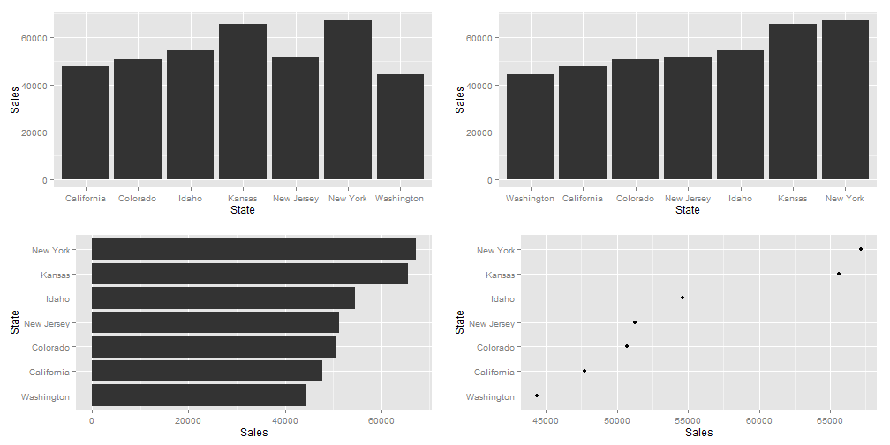
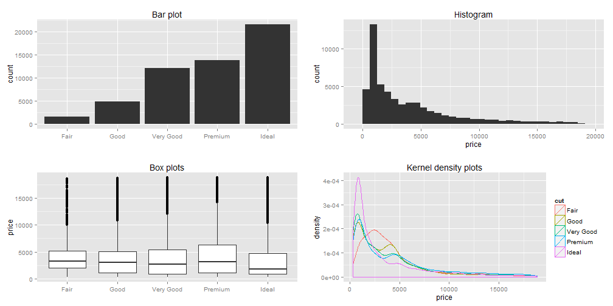
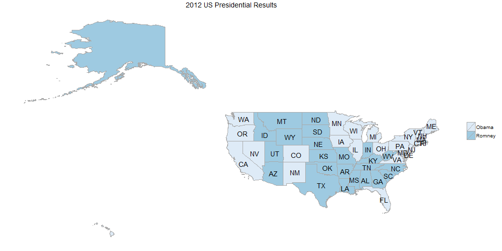

## Representation of quantitative values

* points
* lines
* bars
* boxes
* shapes with varying 2-D areas
* shapes with varying color intensity

---
## Encoding Categorical Variables
 
 * 2D position
 * Hue
 * Point Shape
 * Fill pattern
 * Line Style

---

## Relationships usually displayed in graphs

* Time Series: Changes in variable(s) over time (Change, rise, increase, fluctuate, grow, decline, decrease, trend)
* Ranking (larger/smaller/equal to/greater/lesser)
* Part-to-whole (rate/percent/share of total/accounts for n percent)
* Deviation (absolute/percentage/rate of deviations from a reference value,)
* Distribution (frequency, distribution, range, concentration, normal)
* Correlation (how variables covary - increases/decreases/changes with, caused by, affected by)
* Geospatial (spatial, geographical - county/city/region/state/...)
* Nominal comparison (simple comparison of categorical variables - alphabetical/ascending/descending)

---

## Nominal Comparisons
 

---
## Time Series
 

---
## Ranking

 

---
## Part-to-Whole

 

---
## Part-to-Whole
Pie-charts, for their disadvantages, are easily recognized. Can use bars close to each other.
 

---
## Deviation Designs
 

---
## Studying Distributions

 

---
## More distributions

 

---
## Correlations

 

---
## Geo-Spatial Designs

 

---
## Geo-Spatial Designs

 

---
## Geo-Spatial Designs

 

---
## Geo-Spatial Designs

